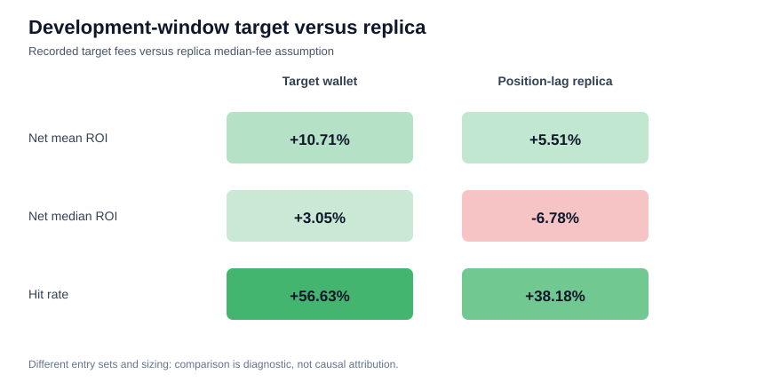

# Corrected target-wallet fee-adjusted PnL and replica comparison

## Cash-flow audit

This run tests whether the target wallet remains profitable after subtracting recorded network
and DEX fees. It does not tune the classifier. Post-deployment cash flows are behavior and
evaluation data only; no realized return, price, trade, or PnL field enters the deployment-time
selector.

The wallet source has 87,004 buy/sell rows and the same number
of unique transaction hashes. Net PnL is `sell receipts - buy costs - gas_usd - dex_usd`.
Priority and tip fees are not added separately because they are already components of the recorded
gas field. Closed-token summaries require both buy and sell activity plus an observed close flag.

## Full-period target description

This section is descriptive competitor analysis, not model selection or final-holdout evaluation.

| metric | value |
|:---|---:|
| Matched closed tokens | 15,921 |
| Gross buy capital | $4,200,092 |
| Gross PnL | $1,468,491 |
| Recorded fees | $545,896 |
| Net PnL | $922,595 |
| Net mean / median ROI | +13.45% / +4.78% |
| Net hit rate | 59.39% |
| Realized max drawdown | 0.84% |

## Strictly pre-holdout comparison

The target window is `2026-06-01T00:00:00+00:00` through
`2026-06-09T15:12:25+00:00` (exclusive). All included target outcomes close
before that boundary; 0 crossing tokens are
excluded. The corrected classification table has SHA-256
`57af874b0768eaf43c54f04d698cda9e3c3e1d9bf3e1a25c7c69910ecbe8817f` and zero UTC clock mismatches and strict-history
violations.

| metric | target wallet, recorded fees | executable position-lag replica, median fees |
|:---|---:|---:|
| Entry rows | 1,372 actual buys | 237 sampled fills / weight 1,245 |
| Net mean ROI | +10.71% | +8.11% |
| Net median ROI | +3.05% | -5.56% |
| Hit rate | 56.63% | 43.53% |
| Max drawdown | 6.89% | 91.96% |
| Net PnL | $48,848 actual | $20,308 weighted proxy |

The overlapping selector operating point is precision 12.03%, recall
20.11%, and F1 0.151. The target is profitable in aggregate,
mean, and median after recorded fees. The corrected position-lag replica has a positive weighted
mean but a negative typical trade and an insolvent tight-capital path, so it is not economically
equivalent to the target.

## Decision and limitations

Decision: `supported_on_development_and_full_descriptive`. This supports the target-wallet fee hypothesis, not replica
profitability. Target results use actual variable sizing and actual entries; replica results use a
fixed notional, sampled negatives with population weights, and a transaction-position entry
proxy. Total dollars are not directly comparable. Cost fields are accepted without independent
on-chain reconciliation, and realized drawdown books PnL at the final sell rather than marking
intratrade risk. The classifier and replica final chronological holdout remain sealed.
