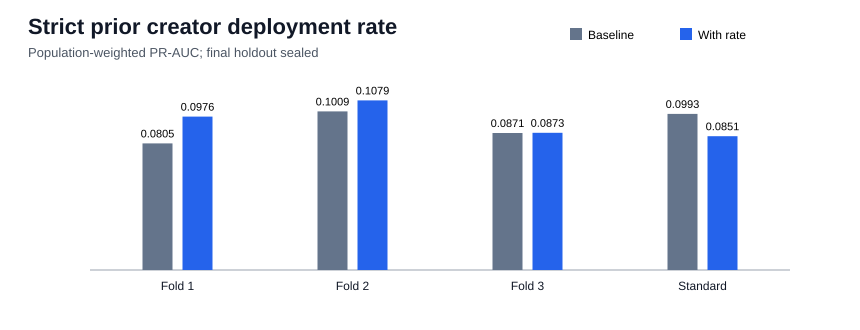

# Strict prior creator deployment rate

## Decision

The added deployment-rate feature is rejected because it does not improve PR-AUC in every predeclared development check. This is a two-run-reproduced development result, not an independent final
estimate; the final chronological holdout remains sealed.

| Fold | Validation period | Baseline PR-AUC | With rate PR-AUC | Delta | Precision | Recall | F1 |
|---:|---|---:|---:|---:|---:|---:|---:|
| 1 | 2026-04-19 to 2026-05-06 | 0.08052 | 0.09763 | +0.01711 | 0.1496 | 0.2735 | 0.1934 |
| 2 | 2026-05-06 to 2026-05-22 | 0.10094 | 0.10794 | +0.00700 | 0.1632 | 0.2863 | 0.2079 |
| 3 | 2026-05-22 to 2026-06-09 | 0.08714 | 0.08728 | +0.00014 | 0.1493 | 0.2055 | 0.1729 |

### Standard validation operating point

| Metric | Baseline | With creator rate | Rate minus baseline |
|---|---:|---:|---:|
| PR-AUC | 0.09933 | 0.08511 | -0.01422 |
| Precision | 0.1736 | 0.1468 | -0.0268 |
| Recall | 0.1714 | 0.2264 | +0.0550 |
| F1 | 0.1725 | 0.1781 | +0.0056 |
| Threshold | 0.948837 | 0.942918 | n/a |

## Interpretation at `t_decision`

The feature divides the number of deployment slots strictly before the current token by observed
days since that creator's first prior deployment, with a one-day floor. Creators with no prior
deployment receive zero. Both inputs are truncated before the current deployment slot, so no later
trade, price, candle, label, realized P&L, or future creator history enters the model.

On standard validation, bought deployments have median historical rate
1.489 per observed day (p90 19.612), versus
6.000 (p90 72.000) for sampled
not-bought deployments. Count-to-rate Spearman correlation is
0.822566. Observed age starts at the first indexed deployment, not
necessarily the wallet's first on-chain transaction.

## Reproducibility boundary

- Dataset: `data/processed/classification_dataset_creator_history.parquet`; SHA-256 `5fc74ffb4d7ac5a0fd26ff5a4cb4326a89d227d273fd3c583ea88d827a018f12`.
- Rows: 218,350; active rows: 136,412; unique
  tokens: 218,350; invalid rate rows:
  0.
- Exactly one feature is added to the retained fee-adjusted outflow baseline.
- Two complete deterministic runs matched the metrics dictionary exactly.
- Maximum evaluated time: `2026-06-09T15:11:49+00:00`.
- Final holdout starts: `2026-06-09T15:12:25+00:00`; no holdout predictions were generated.
