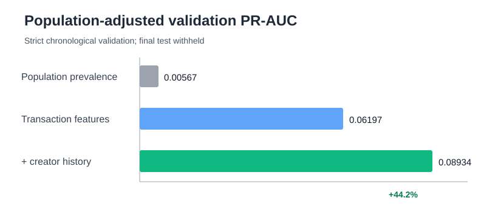

# Creator-history hypothesis

## Decision

Keep for the next candidate. Adding only strict prior-slot deployment-frequency and recency
features improves population-adjusted validation PR-AUC by 44.2%. The final test remains withheld.

| Validation metric | Deployment transaction model | + creator history |
|---|---:|---:|
| Population-adjusted PR-AUC | 0.06197 | 0.08934 |
| Population prevalence | 0.005665 | 0.005665 |
| Selected-threshold precision | 0.1161 | 0.1274 |
| Selected-threshold recall | 0.1738 | 0.2349 |
| Selected-threshold F1 | 0.1392 | 0.1652 |

## Boundary and artifact checks

- Creator key: deployment index `tx_signer`; `creator_address` is almost entirely null.
- Every history window ends at a strictly smaller `blockSlot`; same-slot deployments are excluded.
- Rows: 218,350; unique token addresses: 218,350; strict-time violations: 0.
- Dataset SHA-256: `5fc74ffb4d7ac5a0fd26ff5a4cb4326a89d227d273fd3c583ea88d827a018f12`.
- Code parent: `b2d5a7541fa964f501ecb7e606652fb9807e1131`.
- Final-test status: `withheld_until_candidate_freeze`.

## Interpretation

In the validation period, the raw median prior-deployment count is nearly identical (55 for bought
tokens and 56 for sampled non-buys). The clearer separation is maturity and cadence: bought-token
signers have a 90.1-day median observed age versus 22.5 days and 2.36 median hours since their prior
deployment versus 2.47 minutes. This is consistent with a bot that avoids first-seen and immediately
repeating deployers, although causal claims require stability checks.
