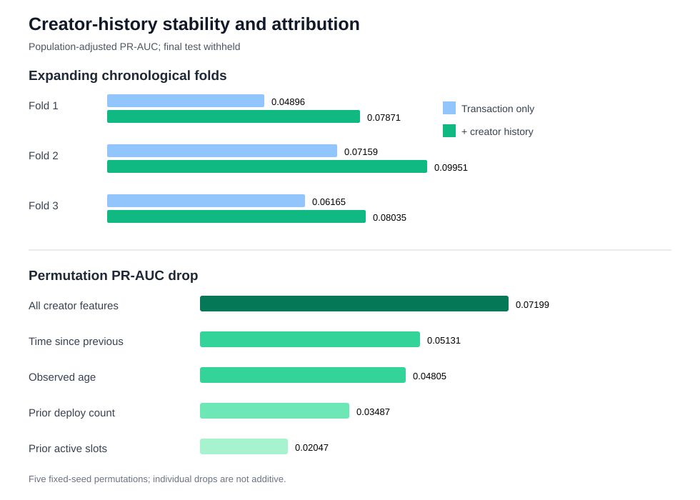

# Creator-history temporal stability and attribution

## Decision

Retain the creator-history family. Its PR-AUC contribution is positive in all three expanding
chronological folds, although the smaller third-fold delta is a drift warning. The final holdout
remains sealed.

| Fold validation period | PR-AUC without | PR-AUC with | Delta | Precision | Recall | F1 |
|---|---:|---:|---:|---:|---:|---:|
| 2026-04-19 to 2026-05-06 | 0.04896 | 0.07871 | +0.02976 | 0.1277 | 0.2399 | 0.1667 |
| 2026-05-06 to 2026-05-22 | 0.07159 | 0.09951 | +0.02792 | 0.1464 | 0.2534 | 0.1856 |
| 2026-05-22 to 2026-06-09 | 0.06165 | 0.08035 | +0.01869 | 0.1282 | 0.1939 | 0.1543 |

## Permutation attribution

The standard validation PR-AUC is 0.08934. Five fixed-seed permutations give:

| Permuted feature or group | Mean permuted PR-AUC | Mean drop |
|---|---:|---:|
| All creator-history features | 0.01735 | 0.07199 |
| Seconds since previous deployment | 0.03803 | 0.05131 |
| Observed creator age | 0.04129 | 0.04805 |
| Prior deployment count | 0.05447 | 0.03487 |
| Prior active-slot count | 0.06887 | 0.02047 |

The individual drops are not additive because the four features are correlated. The group result is
the appropriate evidence that this feature family carries information beyond deployment-transaction
structure.

## Holdout and reproducibility

- Dataset SHA-256: `5fc74ffb4d7ac5a0fd26ff5a4cb4326a89d227d273fd3c583ea88d827a018f12`.
- Code parent: `4fb58f08a1c231e146f79930b5cfbbfb371fd3c8`.
- Maximum evaluated timestamp: `2026-06-09T15:11:49+00:00`.
- Final-test start: `2026-06-09T15:12:25+00:00`.
- Test status: `withheld_no_predictions_generated`.
