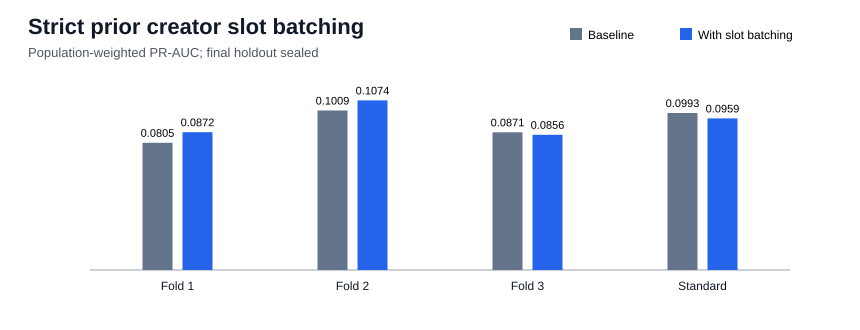

# Strict prior creator slot batching

## Decision

The added historical slot-batching feature is rejected because it does not improve PR-AUC in every predeclared development check. This is a two-run-reproduced development result, not an independent final
estimate; the final chronological holdout remains sealed.

| Fold | Validation period | Baseline PR-AUC | Batch PR-AUC | Delta | Precision | Recall | F1 |
|---:|---|---:|---:|---:|---:|---:|---:|
| 1 | 2026-04-19 to 2026-05-06 | 0.08052 | 0.08721 | +0.00668 | 0.1446 | 0.2433 | 0.1814 |
| 2 | 2026-05-06 to 2026-05-22 | 0.10094 | 0.10736 | +0.00641 | 0.1574 | 0.2623 | 0.1968 |
| 3 | 2026-05-22 to 2026-06-09 | 0.08714 | 0.08556 | -0.00159 | 0.1539 | 0.2002 | 0.1740 |

### Standard validation operating point

| Metric | Baseline | With slot batching | Slot batching minus baseline |
|---|---:|---:|---:|
| PR-AUC | 0.09933 | 0.09592 | -0.00341 |
| Precision | 0.1736 | 0.1587 | -0.0149 |
| Recall | 0.1714 | 0.2011 | +0.0297 |
| F1 | 0.1725 | 0.1774 | +0.0049 |
| Threshold | 0.948837 | 0.944335 | n/a |

## Interpretation at `t_decision`

The feature divides a creator's strictly prior deployment count by the number of distinct
strictly prior deployment slots. A creator with no earlier indexed deployment receives zero.
Because the current slot is excluded from both window aggregates, no current-sibling or future
deployment, later trade, price, candle, label, or realized P&L enters the model.

On standard validation, bought deployments have median historical deployments per active slot
1.000 (p90 1.010), versus
1.000 (p90 1.034) for sampled
not-bought deployments. Count-to-ratio Spearman correlation is
0.715466; active-slots-to-ratio correlation is
0.689805. The ratio covers only deployments in the
supplied indexes and does not prove wallet ownership or intent.

## Reproducibility boundary

- Dataset: `data/processed/classification_dataset_creator_history.parquet`; SHA-256 `5fc74ffb4d7ac5a0fd26ff5a4cb4326a89d227d273fd3c583ea88d827a018f12`.
- Rows: 218,350; active rows: 136,412; unique
  tokens: 218,350; invalid ratio rows:
  0.
- Exactly one feature is added to the retained fee-adjusted outflow baseline.
- Two complete deterministic runs matched the metrics dictionary exactly.
- Maximum evaluated time: `2026-06-09T15:11:49+00:00`.
- Final holdout starts: `2026-06-09T15:12:25+00:00`; no holdout predictions were generated.
