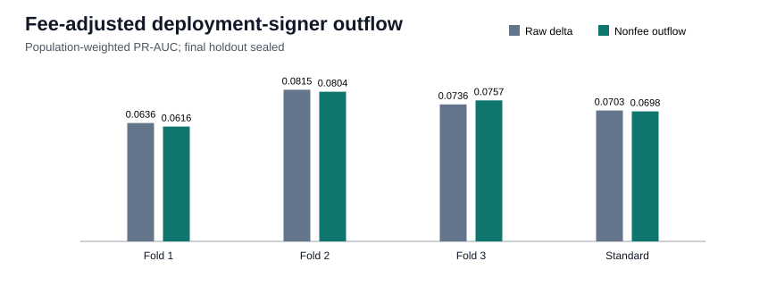

# Deployment-signer fee-adjusted outflow proxy

## Decision

The fee-adjusted deployment-signer outflow proxy is retained for interpretation. It stayed within the predeclared 0.002 PR-AUC noninferiority margin in every development check. It did not increase PR-AUC in every development check, so retention is a semantic noninferiority decision rather than a performance-improvement claim. The full metrics dictionary matched exactly across two
deterministic runs. These are development-period comparisons, not an independent final estimate;
the final chronological holdout remains sealed.

| Fold | Validation period | Raw PR-AUC | Proxy PR-AUC | Delta | Precision | Recall | F1 |
|---:|---|---:|---:|---:|---:|---:|---:|
| 1 | 2026-04-19 to 2026-05-06 | 0.06358 | 0.06164 | -0.00194 | 0.1076 | 0.1924 | 0.1380 |
| 2 | 2026-05-06 to 2026-05-22 | 0.08146 | 0.08040 | -0.00106 | 0.1217 | 0.2431 | 0.1622 |
| 3 | 2026-05-22 to 2026-06-09 | 0.07358 | 0.07575 | +0.00217 | 0.1727 | 0.1586 | 0.1654 |

### Standard validation operating point

| Metric | Raw balance delta | Fee-adjusted outflow | Proxy minus raw |
|---|---:|---:|---:|
| PR-AUC | 0.07028 | 0.06980 | -0.00048 |
| Precision | 0.1203 | 0.1383 | +0.0180 |
| Recall | 0.2011 | 0.1747 | -0.0265 |
| F1 | 0.1506 | 0.1544 | +0.0038 |
| Selected threshold | 0.937099 | 0.945563 | n/a |

## Exact meaning at `t_decision`

The proxy is `max(-signer_lamport_delta - tx_fee_lamports, 0)`. Both inputs come from the
deployment transaction's balance and fee metadata, so no later trade, candle, outcome, or future
history enters the feature.

The precise name is **deployment-signer/fee-payer net nonfee outflow**, not creator dev-buy.
`creator_address` is present in only 0.49% of rows
(1,078/218,350); among those rows, its equality
rate with `tx_signer` is 0.00%.
Without decoding every program transfer, the net outflow may mix buy principal, account rent,
account funding, and protocol transfers.

## Interpretable association

On standard validation, bought tokens have median signer nonfee outflow of
2.847 SOL (p10 0.024, p90 7.011), versus
0.267 SOL for sampled not-bought tokens (p10
0.020, p90 3.797). The raw-to-proxy Spearman
correlation is -0.998638.

The defensible rule hypothesis is therefore: **the target favors deployment transactions whose
signer commits substantially more nonfee lamports**, alongside the previously established signer
history signal. Calling this amount a pure dev-buy would exceed the evidence.

## Reproducibility and boundary

- Dataset: `data/processed/classification_dataset_creator_history.parquet`; SHA-256 `57af874b0768eaf43c54f04d698cda9e3c3e1d9bf3e1a25c7c69910ecbe8817f`.
- Rows: 218,350; unique tokens: 218,350;
  duplicate transaction-hash rows: 28.
- Model: the frozen HGB parameters, with exactly one feature replaced and feature count unchanged.
- Reproduction: 2 deterministic runs matched
  the complete metrics dictionary exactly.
- Maximum evaluated time: `2026-06-09T15:11:49+00:00`.
- Final holdout starts: `2026-06-09T15:12:25+00:00`; no holdout predictions were generated.
- Code parent: `ee3e5cc02979823139d916729374fe23776a1dbc`.
