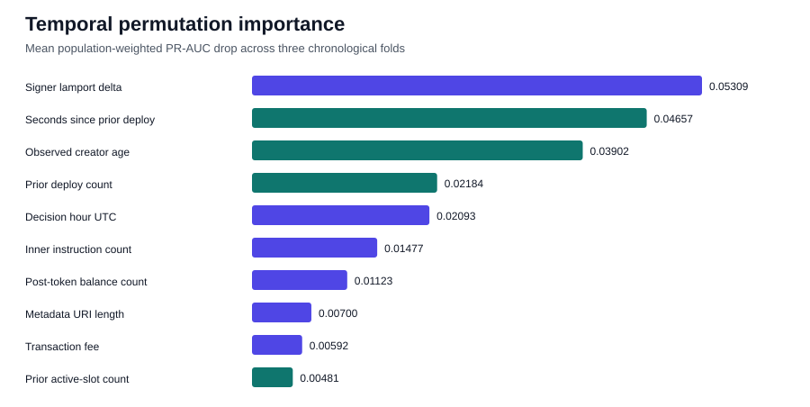

# Leak-free temporal feature attribution

## Decision

The hypothesis is supported on development folds: strict prior deployment-signer history ranks first and has a positive permutation drop in every fold. It is not an overwhelming lead: the mean drop is 0.05661 versus 0.05262 for transaction structure. This is an interpretability result, not a new performance claim. The final
chronological holdout remains sealed.

| Group | Mean temporal PR-AUC drop | Minimum fold drop | Positive folds | Standard validation drop |
|---|---:|---:|---:|---:|
| creator history | 0.05661 | 0.04928 | 3/3 | 0.05461 |
| transaction structure | 0.05262 | 0.04629 | 3/3 | 0.04980 |
| metadata | 0.01148 | 0.00570 | 3/3 | 0.00439 |
| fee and compute | 0.00858 | 0.00637 | 3/3 | 0.01006 |
| transaction error | 0.00000 | 0.00000 | 0/3 | 0.00000 |
| decision time | -0.00029 | -0.00291 | 2/3 | 0.00051 |

## Temporal checks

| Fold | Validation period | Baseline PR-AUC | Creator-history drop | Largest group |
|---|---|---:|---:|---|
| 1 | 2026-04-19 to 2026-05-06 | 0.06358 | 0.04928 | creator history |
| 2 | 2026-05-06 to 2026-05-22 | 0.08146 | 0.06518 | creator history |
| 3 | 2026-05-22 to 2026-06-09 | 0.07358 | 0.05537 | creator history |

### Standard validation operating point

| Metric | Value |
|---|---:|
| PR-AUC | 0.07028 |
| Precision | 0.1203 |
| Recall | 0.2011 |
| F1 | 0.1506 |
| Selected threshold | 0.937099 |

## Top-10 individual features

The rank is the mean weighted PR-AUC loss across three expanding chronological validation folds.
The sampled class medians are a directional description only; correlated importances are not
additive.

| Rank | Feature | Mean temporal drop | Positive folds | Bought median | Not-bought median |
|---:|---|---:|---:|---:|---:|
| 1 | Signer lamport delta | 0.04372 | 3/3 | -2,846,828,720 | -266,968,190 |
| 2 | Seconds since prior deploy | 0.04018 | 3/3 | 8,249.0 | 149.0 |
| 3 | Observed signer deploy age | 0.02949 | 3/3 | 7,794,285 | 1,975,652 |
| 4 | Prior signer deploy count | 0.02101 | 3/3 | 59.000 | 57.000 |
| 5 | Inner instruction count | 0.01047 | 3/3 | 26.000 | 28.000 |
| 6 | Post-token balance count | 0.00876 | 3/3 | 2.000 | 3.000 |
| 7 | Metadata URI length | 0.00778 | 3/3 | 64.000 | 67.000 |
| 8 | Transaction fee | 0.00654 | 3/3 | 96,941.0 | 33,687.0 |
| 9 | Prior signer active-slot count | 0.00538 | 3/3 | 57.000 | 51.000 |
| 10 | Log message count | 0.00528 | 2/3 | 109.0 | 111.0 |

## Plain-language rule hypothesis

The model is most consistent with two strong, complementary screens: observed deployment-signer
maturity/spacing and the construction of the deployment transaction. It does **not** establish
that either screen is evaluated first. The four strict-history associations are:

- **Prior signer deploy count:** selected tokens have a higher validation median (59.000 vs 57.000); temporal mean PR-AUC drop is 0.02101.
- **Prior signer active-slot count:** selected tokens have a higher validation median (57.000 vs 51.000); temporal mean PR-AUC drop is 0.00538.
- **Observed signer deploy age:** selected tokens have a higher validation median (7,794,285 vs 1,975,652); temporal mean PR-AUC drop is 0.02949.
- **Seconds since prior deploy:** selected tokens have a higher validation median (8,249.0 vs 149.0); temporal mean PR-AUC drop is 0.04018.

These are associations learned from strictly pre-decision fields. They do not prove the wallet's
implementation or a causal trading rule. The strongest individual diagnostic is
Signer lamport delta with mean temporal drop
0.04372. The transaction-structure family remains close to
strict history, so the practical rule hypothesis must retain both. All four strict history features have positive drops in every fold.

## Reproducibility and holdout boundary

- Dataset: `data/processed/classification_dataset_creator_history.parquet`; SHA-256 `57af874b0768eaf43c54f04d698cda9e3c3e1d9bf3e1a25c7c69910ecbe8817f`.
- Strict-history manifest: `data/processed/creator_history_manifest.json`; SHA-256
  `67ecadcdf40c2e5f7656a6c217a0937b09e14fa1f54e010a398092e88e690570`.
- Rows: 218,350; unique tokens: 218,350;
  positives: 15,927;
  negatives: 202,423.
- Strict-history violations: 0; UTC feature
  mismatches:
  0.
- Temporal permutations: 3 deterministic repeats per feature/group;
  standard validation: 5 repeats.
- Two complete experiment runs matched the metrics dictionary exactly.
- Same-slot and future signer history are excluded; no later trades, candles, prices, labels,
  realized P&L, or outcome fields enter the model.
- Maximum evaluated time: `2026-06-09T15:11:49+00:00`.
- Final holdout starts: `2026-06-09T15:12:25+00:00` and was not predicted.
- Code parent: `218ffc379d9a4845f76e3be08985b9074b3f6ec8`.
