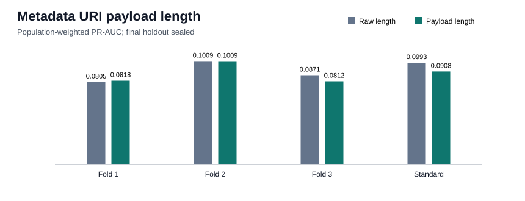

# Metadata URI payload length at deployment

## Decision

The payload-length replacement is rejected because at least one development check exceeds the predeclared 0.002 PR-AUC loss margin. This is a two-run-reproduced development result, not an independent final
estimate; the final chronological holdout remains sealed.

| Fold | Validation period | Raw PR-AUC | Payload PR-AUC | Delta | Precision | Recall | F1 |
|---:|---|---:|---:|---:|---:|---:|---:|
| 1 | 2026-04-19 to 2026-05-06 | 0.08052 | 0.08179 | +0.00127 | 0.1596 | 0.1815 | 0.1698 |
| 2 | 2026-05-06 to 2026-05-22 | 0.10094 | 0.10086 | -0.00008 | 0.1643 | 0.2143 | 0.1860 |
| 3 | 2026-05-22 to 2026-06-09 | 0.08714 | 0.08125 | -0.00589 | 0.1216 | 0.2285 | 0.1587 |

### Standard validation operating point

| Metric | Raw URI length | URI payload length | Payload minus raw |
|---|---:|---:|---:|
| PR-AUC | 0.09933 | 0.09080 | -0.00853 |
| Precision | 0.1736 | 0.1726 | -0.0010 |
| Recall | 0.1714 | 0.1717 | +0.0003 |
| F1 | 0.1725 | 0.1721 | -0.0004 |
| Threshold | 0.948837 | 0.952320 | n/a |

## Interpretation at `t_decision`

The replacement subtracts the seven-character `ipfs://` scheme prefix from IPFS URIs. URI length
and the IPFS flag are parsed from deployment metadata, so the feature is available at
`t_decision`; no later trade, price, candle, label, realized P&L, or future deployer history enters
the model. The existing IPFS flag remains in both variants, isolating the length reparameterization.

On standard validation, bought deployments have median payload length
64.0 characters (p90
73.0), versus
60.0 (p90
73.0) for sampled not-bought deployments. The raw-to-payload
Spearman correlation is 0.899532. Because URI text was not stored,
other schemes and IPFS gateway URLs cannot be normalized.

## Reproducibility boundary

- Dataset: `data/processed/classification_dataset_creator_history.parquet`; SHA-256 `5fc74ffb4d7ac5a0fd26ff5a4cb4326a89d227d273fd3c583ea88d827a018f12`.
- Rows: 218,350; active rows: 136,412; unique
  tokens: 218,350; negative payload rows:
  0.
- Exactly one feature is replaced on the retained fee-adjusted outflow baseline.
- Two complete deterministic runs matched the metrics dictionary exactly.
- Maximum evaluated time: `2026-06-09T15:11:49+00:00`.
- Final holdout starts: `2026-06-09T15:12:25+00:00`; no holdout predictions were generated.
