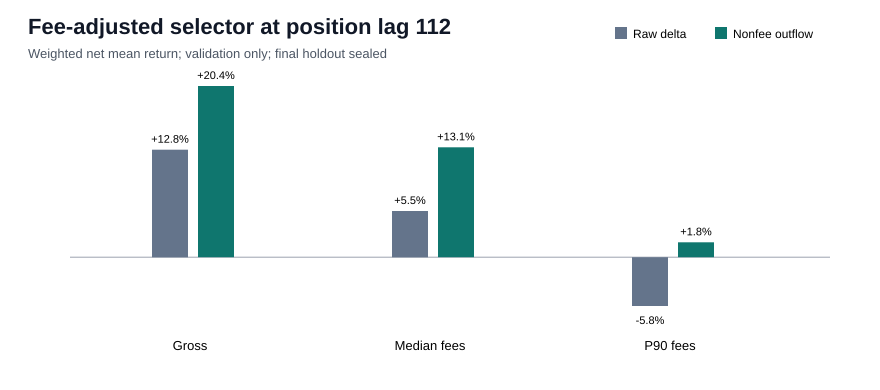

# Fee-adjusted selector under transaction-position lag

## Decision

The hypothesis **fails** the predeclared development criterion. The frozen entry floor is
112 transactions after deployment. This is a reproduced
validation diagnostic; the final chronological holdout remains sealed.

| Fee | Raw mean | Proxy mean | Raw median | Proxy median | Raw hit | Proxy hit | Raw MDD | Proxy MDD | Raw solvent | Proxy solvent |
|---|---:|---:|---:|---:|---:|---:|---:|---:|:---:|:---:|
| gross | +12.81% | +20.40% | +0.52% | +1.74% | 46.04% | 50.43% | 47.95% | 46.65% | True | True |
| training_median_fee | +5.51% | +13.09% | -6.78% | -5.56% | 38.18% | 48.94% | 111.97% | 73.37% | False | True |
| training_p90_fee | -5.81% | +1.77% | -18.10% | -16.88% | 31.36% | 40.62% | 258.96% | 205.17% | False | False |

## Classifier and candidate coverage

The only feature change is `signer_lamport_delta` to `deployment_signer_nonfee_outflow_lamports`. Population-adjusted validation
PR-AUC is 0.08934 versus
0.09933; precision is
0.1274 versus 0.1736; recall is
0.2349 versus 0.1714; and F1 is
0.1652 versus 0.1725.

The raw selector chooses 387 June development rows and the proxy
chooses 253, with Jaccard overlap 0.6410.
The proxy has 181/253 sampled same-slot
fills (71.54%); population-weighted coverage is
63.84%.

## Boundary and interpretation

- Position and wallet behavior parameters use only events through `2026-05-18T16:44:18+00:00`.
- Maximum selected decision time is `2026-06-09T15:07:15+00:00`.
- Final holdout starts at `2026-06-09T15:12:25+00:00` and has no predictions.
- Two complete deterministic runs match the full metrics dictionary exactly.
- Transaction position and six-second exit remain proxies, not guaranteed executable fills.
