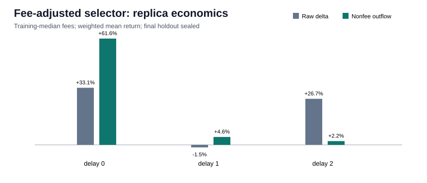

# Fee-adjusted outflow replica comparison

## Decision

The hypothesis passes the predeclared development criterion. Mean return improved for 2/3 requested delays;
zero-slot solvency was True; insolvent delays changed from
2 to 0.
This is a reproduced validation diagnostic, not an independent final estimate.

| Delay | Raw mean | Proxy mean | Delta | Raw median | Proxy median | Raw hit | Proxy hit | Raw MDD | Proxy MDD |
|---:|---:|---:|---:|---:|---:|---:|---:|---:|---:|
| 0 | +33.08% | +61.58% | +28.50% | +15.42% | +18.67% | 43.92% | 61.30% | 11.47% | 4.11% |
| 1 | -1.47% | +4.58% | +6.06% | -11.73% | -10.96% | 30.00% | 39.73% | 269.96% | 74.73% |
| 2 | +26.66% | +2.17% | -24.50% | -9.74% | -8.65% | 25.64% | 29.50% | 197.01% | 48.94% |

## Classifier and selection

The only model change is replacing `signer_lamport_delta` with `deployment_signer_nonfee_outflow_lamports`. Population-adjusted
validation PR-AUC changed from 0.08934 to
0.09933; precision changed from
0.1274 to 0.1736, recall from
0.2349 to 0.1714, and F1 from
0.1652 to 0.1725. The June development selections
contain 387 raw and 253
proxy rows with Jaccard overlap 0.6410.

## Frozen execution and boundary

- Exit: training-only target-wallet median hold, fixed at six seconds.
- Fees: gross, training median, and training p90 roundtrip fees; all scenarios are in the JSON.
- Entries: first observed trade at or after deploy slot + 0/1/2, excluding deployment transaction.
- Maximum proxy-selected decision time: `2026-06-09T15:07:15+00:00`.
- Final holdout starts: `2026-06-09T15:12:25+00:00` and remains sealed.
- Reproduction: two full deterministic runs matched the complete metrics dictionary exactly.

## Interpretation limits

The entry rule is optimistic and the exit is a mark rather than a guaranteed fill. This result does
not supersede the separate transaction-position-lag test, which rejected zero-slot feasibility.
Post-deployment trades are used only for backtest outcomes, never as classifier features.
