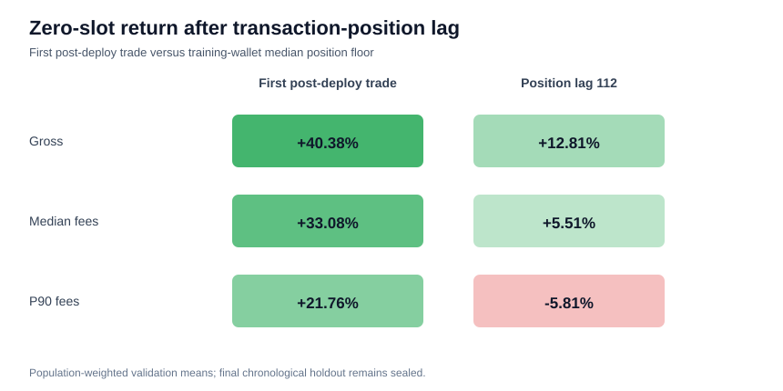

# Corrected zero-slot transaction-position feasibility (validation only)

## Hypothesis and frozen policy

This corrected run asks whether the raw signer-delta plus strict creator-history selector remains
economically viable when zero-slot entry uses the target wallet's training-derived transaction
position instead of the first observed post-deployment trade. The classifier uses only fields
available at token deployment (`t_decision`). Post-deployment trades are used only for entry and
six-second exit marks. The final chronological holdout remains sealed.

- Corrected classification SHA-256: `57af874b0768eaf43c54f04d698cda9e3c3e1d9bf3e1a25c7c69910ecbe8817f`.
- Training cutoff: `2026-05-18T16:44:18+00:00`; validation ends
  `2026-06-09T15:11:49+00:00`; final holdout starts
  `2026-06-09T15:12:25+00:00`.
- Classifier: PR-AUC 0.07028, precision
  0.12034, recall 0.20112, F1
  0.15058, threshold 0.937099.
- Frozen entry floor: deployment transaction index plus
  112 positions, the median of
  7,377 training-period same-slot target-wallet buys (p10 25,
  p90 421).
- Exit: last observed trade mark no later than entry plus six seconds.
- Fees and notional: derived only from target-wallet events through the training cutoff.

## Execution coverage

The policy attempts 335 selected validation candidates (population
weight 2,183) and obtains same-slot fills for
237 (population weight 1,245).
Coverage is 70.75% by sampled rows and
57.03% after population weighting. Actual filled
position gaps have median 230 and p90
607.6. This is a transaction-position proxy, not proof of
live same-slot reaction.

## Results

| fee scenario | weighted mean | unweighted median | weighted hit rate | max drawdown | insolvent |
|:---|---:|---:|---:|---:|:---:|
| Gross | +15.41% | +1.74% | 50.44% | 35.88% | no |
| Training median | +8.11% | -5.56% | 43.53% | 91.96% | yes |
| Training p90 | -3.21% | -16.88% | 35.66% | 319.90% | yes |

The transaction-position adjustment changes the median-fee weighted mean by
-66.75% versus the corrected first-observed
trade proxy. Under the predeclared criterion, the executable-position candidate **fails**:
both weighted mean and unweighted median must be positive at training-median fees, and the capital
path must remain solvent. Decision: `rejected_position_lag_fails_fee_robust_capital_criterion`.

## Integrity and limits

The corrected UTC hour and weekday mismatch counts are both zero, strict-history violations are
zero, selected decisions end at `2026-06-09T15:07:15+00:00`, and the latest
post-deployment outcome mark is `2026-06-09T15:07:21+00:00`, strictly before the sealed
holdout. Two complete deterministic runs must match before artifacts are written. The six-second
exit is still a mark rather than a demonstrated executable sell; population weighting estimates
omitted negatives but cannot recover their exact portfolio path.
