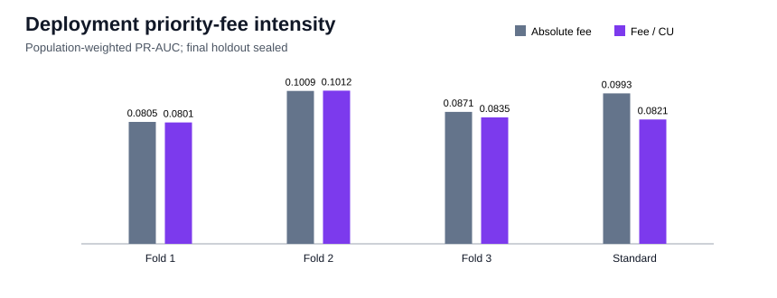

# Priority-fee intensity at deployment

## Decision

The intensity replacement is rejected because at least one development check exceeds the predeclared 0.002 PR-AUC loss margin. This is a two-run-reproduced development result, not an independent final
estimate; the final chronological holdout remains sealed.

| Fold | Validation period | Absolute PR-AUC | Intensity PR-AUC | Delta | Precision | Recall | F1 |
|---:|---|---:|---:|---:|---:|---:|---:|
| 1 | 2026-04-19 to 2026-05-06 | 0.08052 | 0.08013 | -0.00039 | 0.1499 | 0.1908 | 0.1679 |
| 2 | 2026-05-06 to 2026-05-22 | 0.10094 | 0.10115 | +0.00021 | 0.1662 | 0.2154 | 0.1876 |
| 3 | 2026-05-22 to 2026-06-09 | 0.08714 | 0.08348 | -0.00366 | 0.1426 | 0.1845 | 0.1609 |

### Standard validation operating point

| Metric | Absolute priority fee | Fee per compute unit | Intensity minus absolute |
|---|---:|---:|---:|
| PR-AUC | 0.09933 | 0.08213 | -0.01720 |
| Precision | 0.1736 | 0.1284 | -0.0452 |
| Recall | 0.1714 | 0.2490 | +0.0776 |
| F1 | 0.1725 | 0.1694 | -0.0031 |
| Threshold | 0.948837 | 0.923436 | n/a |

## Interpretation at `t_decision`

The feature is `priority_fee_lamports / compute_units`. Both values come from the observed
deployment transaction. It is therefore available at `t_decision`; no later trade, price, candle,
label, realized P&L, or future deployer history enters the model.

On standard validation, bought deployments have median intensity 0.4055 lamports/CU
(p90 5.1911), versus 0.1050 (p90
5.2277) for sampled not-bought deployments. The raw-to-intensity Spearman
correlation is 0.991586. Consumed compute units are not the
requested compute limit, so this is a realized transaction-urgency proxy rather than an exact bid.

## Reproducibility boundary

- Dataset: `data/processed/classification_dataset_creator_history.parquet`; SHA-256 `5fc74ffb4d7ac5a0fd26ff5a4cb4326a89d227d273fd3c583ea88d827a018f12`.
- Rows: 218,350; active rows: 136,412; unique
  tokens: 218,350; nonpositive compute rows:
  0.
- Exactly one feature is replaced on the retained fee-adjusted outflow baseline.
- Two complete deterministic runs matched the metrics dictionary exactly.
- Maximum evaluated time: `2026-06-09T15:11:49+00:00`.
- Final holdout starts: `2026-06-09T15:12:25+00:00`; no holdout predictions were generated.
