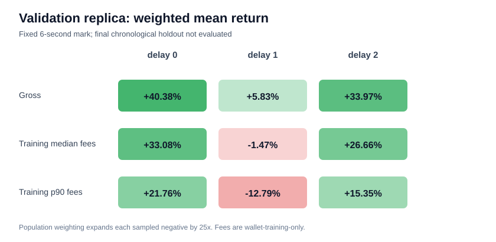

# Six-second replica backtest (validation only)

## Question and frozen inputs

This run tests one hypothesis: the target wallet's **training-only** median hold can be used as a
fixed replica exit rule. It does not tune the exit horizon or fees against returns. Wallet events
through the classifier train end (`2026-05-18 16:44:18 UTC`) give:

- median hold: 6 seconds (9,892 observed closed tokens; mean 11.29 seconds; p90 18 seconds);
- median first-buy notional: USD 201.16;
- median buy-plus-sell fee: 730.22 bps;
- p90 buy-plus-sell fee: 1,862.05 bps.

The histogram gradient-boosting model was fitted only on the chronological training partition.
Its validation operating point is threshold 0.93002, population-adjusted PR-AUC 0.08934,
precision 0.12735, recall 0.23493, and F1 0.16517. Each sampled negative has population weight
25. The threshold selects 387 sampled June validation deployments (population weight 2,523).

No prediction or outcome at or after the final-holdout start (`2026-06-09 15:12:25 UTC`) was
used. The latest selected deployment is `14:40:21 UTC`; the latest backtest mark is `14:40:28
UTC`.

## Execution and return definitions

For each requested delay, entry is the first observed trade at or after deployment slot plus
0/1/2. `all observed` includes later fills and therefore reports actual delays. `exact only`
executes only when a trade exists on the requested target slot; non-fills are not assigned a
return. The exit is the last observed trade mark at or before entry time plus six seconds.

Return is `exit_price_usd / entry_price_usd - 1`. The fee scenarios subtract zero, the training
median round-trip bps, or the training p90 round-trip bps. Hit rate and mean return are population
weighted; median return is unweighted. Maximum drawdown starts with enough USD 201.16 notionals
to fund the maximum concurrent population-weighted positions and realizes PnL at the fixed exit
time. Drawdown above 100% means that this deliberately tight capital model crossed zero.

## Validation results

| requested delay | execution | weighted coverage | actual delay median / p90 | fees | net mean | net median | hit rate | max drawdown | insolvent |
|---:|:---|---:|:---:|:---|---:|---:|---:|---:|:---:|
| 0 | all observed | 100.00% | 0 / 1 | median | +33.08% | +15.42% | 43.92% | 11.47% | no |
| 0 | all observed | 100.00% | 0 / 1 | p90 | +21.76% | +4.10% | 35.91% | 29.45% | no |
| 0 | exact only | 76.42% | 0 / 0 | median | +43.80% | +18.22% | 52.96% | 3.11% | no |
| 1 | all observed | 100.00% | 1 / 2 | median | -1.47% | -11.73% | 30.00% | 269.96% | yes |
| 1 | exact only | 64.01% | 1 / 1 | median | +0.01% | -12.70% | 35.98% | 235.37% | yes |
| 2 | all observed | 100.00% | 2 / 4 | median | +26.66% | -9.74% | 25.64% | 197.01% | yes |
| 2 | exact only | 39.24% | 2 / 2 | median | -4.37% | -11.73% | 37.17% | 243.91% | yes |

The gross all-observed means are +40.38%, +5.83%, and +33.97% for requested delays 0, 1, and 2.
The positive delay-2 mean is not representative of a typical trade: its gross median is -2.43%,
and the median-fee net median is -9.74%. Rare large winners dominate the mean while the equity
path becomes insolvent. Delay 1 is already negative after median fees. Only requested delay 0 is
positive in both weighted mean and unweighted median under all three fee scenarios without
crossing zero in this capital model.

## Decision and limitations

The hypothesis is **supported on development data only for near-zero-slot execution**. It is not
yet a frozen candidate and is not an independent profitability estimate. The final holdout stays
sealed.

The last-trade mark is not a proven executable sell fill and does not model size-dependent
slippage. Exact-only results condition on target-slot liquidity and should not be generalized to
non-fills. Population weighting expands sampled negatives but cannot reconstruct the omitted
tokens' exact path dependence. Before final evaluation, the exit must be upgraded to a sell-side
execution proxy or presented explicitly as mark-to-market, and zero-slot fill feasibility must be
defended from transaction ordering evidence.

Reproducible aggregates and source hashes are in
`reports/generated/replica_validation_backtest.json` (SHA-256
`730cc0fb3b91b9a8aca5997b782c1e10e10d34af4db8fd1de61395133c40d3a3`). The figure SHA-256 is
`f83a24fd8bfb9db7810bc22f41ac5c6f85e471876b88d64cd85adad1fa3497a1`.
