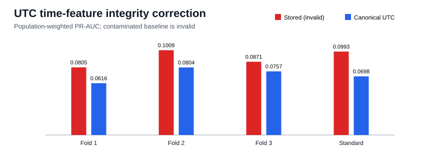

# UTC time-feature integrity correction

## Decision

The stored time baseline is invalid and must be replaced. All
202,423 sampled negative rows have a stored-hour mismatch, while
positive rows have none. The mismatch is class-dependent preprocessing, so the stored-time
performance cannot be described as model quality. The final chronological holdout remains sealed.

| Fold | Validation period | Stored PR-AUC | Canonical PR-AUC | Delta | Precision | Recall | F1 |
|---:|---|---:|---:|---:|---:|---:|---:|
| 1 | 2026-04-19 to 2026-05-06 | 0.08052 | 0.06164 | -0.01888 | 0.1076 | 0.1924 | 0.1380 |
| 2 | 2026-05-06 to 2026-05-22 | 0.10094 | 0.08040 | -0.02054 | 0.1217 | 0.2431 | 0.1622 |
| 3 | 2026-05-22 to 2026-06-09 | 0.08714 | 0.07575 | -0.01140 | 0.1727 | 0.1586 | 0.1654 |

### Standard validation

| Metric | Stored time | Canonical UTC | Canonical minus stored |
|---|---:|---:|---:|
| PR-AUC | 0.09933 | 0.06980 | -0.02953 |
| Precision | 0.1736 | 0.1383 | -0.0353 |
| Recall | 0.1714 | 0.1747 | +0.0032 |
| F1 | 0.1725 | 0.1544 | -0.0181 |
| Threshold | 0.948837 | 0.945563 | n/a |

## Root cause and boundary

The positive pipeline used pandas UTC hour and Monday-zero weekday. The negative pipeline used
DuckDB's session-local hour and Sunday-zero weekday. On this machine, negative hours were shifted
by [16, 17] hours modulo 24 because of
PST/PDT. Canonical features are recomputed directly from the deployment timestamp in UTC, which is
available at `t_decision`. No trade, price, candle, outcome, P&L, or future history is used.

- Dataset: `data/processed/classification_dataset_creator_history_pre_utc_fix.parquet`; SHA-256 `5fc74ffb4d7ac5a0fd26ff5a4cb4326a89d227d273fd3c583ea88d827a018f12`.
- Rows: 218,350; unique tokens:
  218,350; hour mismatches:
  202,423; weekday mismatches:
  150,364.
- Two deterministic development runs matched exactly.
- Maximum evaluated time: `2026-06-09T15:11:49+00:00`.
- Final holdout starts: `2026-06-09T15:12:25+00:00`; no predictions were generated.
